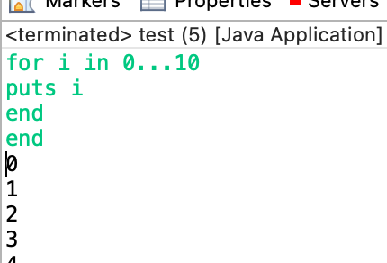

# ruby little compiler

it's a little compiler for ruby programming language made using javacc for education purpose
## supported statement:
* declare a variable
* for
* if 
* print
* while
* do while

## how to run it:
* download eclipse
* download javacc
* download the project 
* import it to eclipse
* go to default package area inside the project and go to test.java and run it

## example of usage:

note: you should put end at last to run the file so the compiler know you're finished
